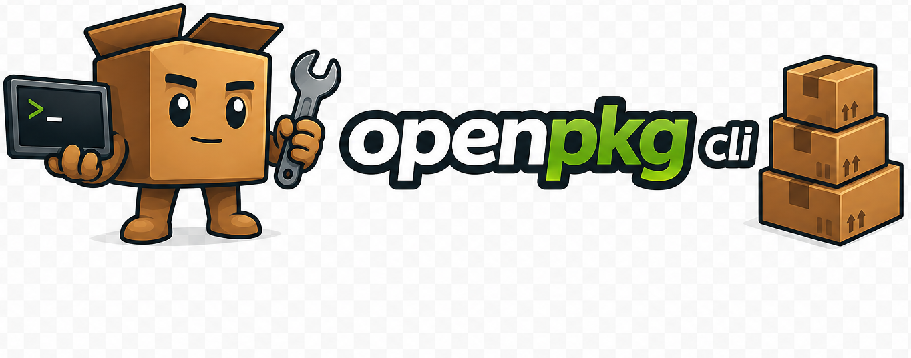

<div align="center">



<p align="center">
  
  
  
  
  
  
  
  
  
  
</p>

</div>

OpenPkg é um centro de controle de desenvolvedor para o terminal, focado em inspeção, diagnóstico e manutenção do ambiente local com uma experiência rápida, bonita e guiada por teclado.

Ele combina TUI interativa e comandos headless para gerenciar projetos, caches, artefatos pesados, package managers, runtimes, diagnósticos e fluxos de limpeza em máquinas de desenvolvimento.

## Status

OpenPkg está em desenvolvimento ativo.

A base atual já cobre o núcleo operacional do produto: scans reais, cache, diagnóstico, cleanup protegido, TUI responsiva, navegação por teclado e execução headless. As trilhas `0.2.x` e `0.3.x` já estão consolidadas no código atual, a `0.4.x` está focada em UX/TUI, e a nova `0.5.x` foi reservada para expansão de ecossistemas e package managers antes da `1.0.0`.

## Visão Rápida

OpenPkg foi pensado para ser um Developer Operating Center de terminal, não apenas um launcher de comandos.

Hoje ele ajuda a:

- descobrir projetos locais e classificar atividade recente
- inspecionar caches, artefatos pesados e oportunidades seguras de cleanup
- diagnosticar runtimes, package managers e ferramentas do ambiente
- consultar updates relevantes do ambiente global
- operar via TUI moderna ou via comandos headless reproduzíveis

## Por Que OpenPkg

- UX guiada por teclado, com TUI limpa e foco em fluidez
- mesma base arquitetural para TUI interativa e automação headless
- operações destrutivas protegidas por defaults conservadores
- arquitetura modular preparada para ampliar ecossistemas sem jogar lógica na UI
- roadmap explícito até uma `1.0.0` estável

## Objetivos

OpenPkg não é apenas um wrapper de package managers.

O objetivo é oferecer um Developer Operating Center multiplataforma para:

- gerenciadores de pacotes
- runtimes
- projetos locais
- caches e artefatos de build
- fluxos de limpeza seguros
- diagnósticos e saúde do ambiente
- sinais iniciais de Docker e Python
- futuros plugins, perfis, indexação e diagnósticos assistidos por IA

## Funcionalidades Atuais

- TUI interativa construída com Ink e React.
- Navegação lateral com foco por teclado, footer operacional e transições mais consistentes entre seções.
- Paleta de comandos com comandos slash (`/`), aliases e sugestões fuzzy.
- Tela de informações da ferramenta com versão, links do projeto e contexto da release atual.
- Sistema de tips leve no dashboard para onboarding e discoverability.
- Execução headless para ambientes não interativos.
- Descoberta de projetos em `workspace`, `developer-home` e `machine`.
- Detecção de `node_modules`, `.pnpm-store`, `.npm`, `.turbo`, `.next`, `dist` e `build`.
- Preview de espaço antes da limpeza e resumo pós-operação.
- Dry-run explícito para fluxos headless de cleanup.
- Cleanup real com confirmação forte e validação de alvos permitidos.
- Detecção de React, Next.js, Vue, Angular, Electron, APIs Node e sinais iniciais de Python.
- Detecção de package manager via lockfiles, `packageManager` no `package.json`, `pyproject.toml` e `requirements.txt`.
- Check automático de updates para `npm`, `pnpm`, `yarn`, `bun` e `Node` dentro do Doctor.
- Cache remoto de updates com reaproveitamento em `Doctor` e `/updates`.
- Sinais de Docker e Python em projetos e diagnósticos.
- Cache de snapshots em `.openpkg/cache.json`.
- Layout responsivo para diferentes tamanhos de terminal.
- Feedback de progresso incremental durante scan, preview e exclusão.
- Filtros e ordenações locais para listas de projetos e cleanup.
- Drill-down compacto e viewport interno para seções mais densas em terminais pequenos.

## Ecossistemas

Esta seção resume o que o OpenPkg já consegue operar hoje e o que ainda está planejado para a fase `0.5.x`.

### Já Cobertos No Código Atual

| Ecossistema | Status | O que já funciona |
| --- | --- | --- |
| Node.js | forte | base principal do produto, doctor, updates, scans e execução headless |
| npm | forte | detecção no ambiente, versão, update check e sinais em projetos |
| pnpm | forte | detecção no ambiente, versão, update check e sinais em projetos |
| yarn | forte | detecção no ambiente, versão, update check e sinais em projetos |
| Bun | bom | detecção em projetos, disponibilidade local e update check |
| Python | parcial | sinais em projetos, `python --version` no doctor e detecção de `pyproject.toml`/`requirements.txt` |
| pip | parcial | inferência em projetos por `requirements.txt` |
| Poetry | parcial | inferência em projetos por `pyproject.toml` |
| uv | parcial | inferência em projetos por `pyproject.toml` |
| Docker | parcial | sinais em projetos e disponibilidade no doctor |

### Planejados Para A Fase `0.5.x`

| Ecossistema | Status planejado | Escopo esperado |
| --- | --- | --- |
| Python | expansão | aprofundar inventário, saúde básica e melhorar a leitura do ecossistema |
| pip | expansão | enriquecer diagnóstico e visibilidade no ambiente |
| Poetry | expansão | enriquecer diagnóstico e visibilidade no ambiente |
| uv | expansão | enriquecer diagnóstico e visibilidade no ambiente |
| Docker | expansão | ampliar inventário e diagnóstico antes de qualquer limpeza profunda |
| Deno | planejado | detecção, versão instalada e sinais de projeto |
| Cargo / Rust | planejado | detecção, versão instalada e sinais de projeto |
| RubyGems | planejado | sinais de ambiente e projeto quando fizer sentido |
| NuGet / .NET | planejado | sinais de ambiente e projeto quando fizer sentido |
| Homebrew | planejado | visibilidade de disponibilidade no ambiente, respeitando plataforma |
| Chocolatey | planejado | visibilidade de disponibilidade no ambiente, respeitando plataforma |

### Ainda Não É Objetivo Desta Fase

- automação destrutiva específica por ecossistema
- gerenciamento profundo de containers, volumes e imagens Docker
- workflows completos de ambientes virtuais Python
- sistema completo de plugins
- indexação contínua em background

## Stack

- Node.js 20+
- TypeScript
- React
- Ink
- `@inkjs/ui`
- execa
- chalk
- gradient-string
- boxen
- zod
- fast-glob
- tsup
- Vitest
- ESLint
- Prettier
- pnpm

## Instalação

### Uso Via npm

Instale globalmente para abrir o OpenPkg de qualquer terminal:

```bash
npm install -g openpkg
openpkg
```

O pacote também instala o alias curto `opkg`:

```bash
opkg
opkg /doctor
```

Se você não quiser instalar globalmente, use `npx`:

```bash
npx openpkg
npx openpkg /doctor
npx openpkg /updates
npx openpkg /updates --cached
npx openpkg /scan machine
```

Para chamar o alias curto via `npx`, use:

```bash
npx -p openpkg opkg
```

Nota: existe outro pacote no npm chamado `openpkg-cli` que também registra o binário global `openpkg`. Se houver colisão em uma máquina que já tenha esse pacote instalado, use `opkg` como alias seguro para este projeto.

### Desinstalação

Se você instalou o OpenPkg globalmente e quiser remover:

```bash
npm uninstall -g openpkg
```

Após a desinstalação, os comandos `openpkg` e `opkg` deixam de apontar para este pacote.

### Uso Local Para Desenvolvimento

### Requisitos

- Node.js 20 ou superior
- Corepack habilitado ou pnpm instalado

### Setup

```bash
corepack enable
corepack pnpm install
corepack pnpm dev
```

Se você já tiver `pnpm` instalado globalmente, também pode usar:

```bash
pnpm install
pnpm dev
```

### Build

```bash
pnpm build
```

### Verificações de Qualidade

```bash
pnpm typecheck
pnpm lint
pnpm test
```

### Smoke

```bash
pnpm smoke:local
pnpm smoke:package
pnpm smoke
```

`pnpm smoke:local` valida o binário em `dist/cli.js`. `pnpm smoke:package` gera um tarball local, instala o pacote em um projeto temporário e verifica os bins `openpkg` e `opkg` com `/help`.

### Release Notes

```bash
pnpm release:notes -- --tag v0.2.0
```

Esse comando valida se a tag segue o padrão `vX.X.X`, confere se ela bate com a versão atual do `package.json` e extrai a seção correspondente do `CHANGELOG.md` para o workflow de release.

## Executando o OpenPkg

OpenPkg roda em dois modos complementares:

- `TUI`: quando aberto sem argumentos em um terminal interativo
- `Headless`: quando executado com slash commands, útil para automação, smoke e inspeção rápida

### TUI Interativa

```bash
openpkg
opkg
pnpm dev
```

Após o build:

```bash
node dist/cli.js
```

### Headless

```bash
openpkg /doctor
openpkg /updates
opkg /projects workspace
openpkg /cleanup workspace --dry-run
node dist/cli.js /doctor
node dist/cli.js /updates
node dist/cli.js /projects workspace
node dist/cli.js /cache machine
node dist/cli.js /cleanup workspace --dry-run
node dist/cli.js /cleanup workspace --delete-safe --confirm
node dist/cli.js /scan machine
```

## Comandos

- `/scan`: executa varredura completa de projetos, cleanup e doctor.
- `/projects`: mostra inventário de projetos.
- `/cache`: mostra diretórios de cache e artefatos.
- `/cleanup`: prepara candidatos de limpeza.
- `/doctor`: executa diagnósticos de ambiente.
- `/updates`: checa updates disponíveis para as ferramentas globais do ambiente.
- `/help`: lista comandos e aliases.
- `/settings`: abre a área de configurações.
- `/info`: abre a tela de informações da ferramenta e créditos.

Exemplos úteis:

```bash
openpkg /scan machine
openpkg /doctor
openpkg /updates --force
openpkg /cleanup workspace --dry-run
openpkg /info
```

## Escopos

OpenPkg aceita escopo por argumento posicional ou flag.

```bash
/scan workspace
/scan machine
/projects --scope=workspace
/cache machine
/cleanup developer-home
```

- `workspace`: escaneia apenas o diretório atual.
- `developer-home`: escaneia raízes comuns de desenvolvimento dentro do home.
- `machine`: escaneia amplamente o home do usuário para encontrar projetos e artefatos de dev.

Para updates do ambiente:

- `Doctor` consulta versões locais ao vivo e reaproveita o cache remoto de updates quando ele ainda está fresco.
- `/updates --cached` usa apenas o cache remoto salvo anteriormente.
- `/updates --force` ignora o cache remoto e consulta as fontes online novamente.

## Navegação

- `Tab`: alternar foco entre sidebar e conteúdo.
- `h` ou seta esquerda: focar sidebar.
- `l` ou seta direita: focar conteúdo.
- `j` ou seta baixo: mover seleção para baixo.
- `k` ou seta cima: mover seleção para cima.
- `PgUp` e `PgDn`: navegar uma página por vez em listas longas.
- `Home` e `End`: ir para o primeiro ou último item da lista atual.
- `f`: alternar o filtro ativo em Projects e Cleanup.
- `o`: alternar a ordenação ativa em Projects e Cleanup.
- `Enter`: abrir ou fechar o drill-down compacto de detalhes em Projects e Cleanup quando o layout compacto estiver ativo.
- `Esc`: voltar para a lista quando o drill-down compacto estiver aberto.
- `/`: abrir paleta de comandos.
- `i`: abrir a tela `Info`.
- `r`: recarregar seção atual.
- `Ctrl+C`: sair.

## Cleanup

Cleanup é uma operação destrutiva real. OpenPkg usa um modelo conservador por padrão.

- Na TUI, a exclusão exige armar a operação com `x` e confirmar com `y`.
- No modo headless, `--delete-safe` sem `--confirm` gera preview/dry-run e não deleta arquivos.
- Para deletar em modo headless, use `--delete-safe --confirm`.
- O executor recusa raiz do sistema, caminhos inesperados, mismatch de tipo e alvos que não são diretórios.
- O resumo pós-limpeza mostra itens deletados, falhas e espaço estimado recuperado.

Exemplos:

```bash
node dist/cli.js /cleanup workspace --dry-run
node dist/cli.js /cleanup machine --delete-safe
node dist/cli.js /cleanup workspace --delete-safe --confirm
```

## Detecção de Projetos

OpenPkg detecta projetos usando sinais como:

- `package.json`
- `pyproject.toml`
- `requirements.txt`
- `Dockerfile`
- `docker-compose.yml`
- `docker-compose.yaml`
- `compose.yml`
- `compose.yaml`

A partir desses sinais, o scanner infere nome, framework, package manager, tamanho, atividade recente e metadados de ecossistema.

Hoje a cobertura de projeto é mais madura para o ecossistema JS/Node. Python e Docker ainda aparecem como sinais e detecção inicial; a expansão dedicada desses ecossistemas está planejada para a `0.5.x`.

## Estrutura

```text
src/
├── app/
├── commands/
├── core/
├── hooks/
├── modules/
├── plugins/
├── services/
├── shared/
├── types/
├── ui/
└── utils/
```

## Arquitetura

A base é modular por design.

- `commands/`: parser, registry e comandos built-in.
- `modules/dashboard/`: orquestração de comandos, scans e estado.
- `services/`: filesystem, cache, cleanup, scanner e diagnóstico.
- `ui/`: layout, componentes e telas Ink.
- `shared/`: tema, constantes e schemas compartilhados.
- `types/`: contratos públicos entre módulos.

O fluxo principal preserva a cadeia `CommandDefinition -> CommandRegistry -> DashboardController -> services -> DashboardDataSnapshot`, mantendo a UI consumindo dados prontos em vez de acessar serviços diretamente.

Essa organização prepara o projeto para ampliar suporte de ecossistemas, plugins, perfis de workspace, indexação em background e diagnósticos assistidos por IA sem acoplamento rígido ao núcleo atual.

## Roadmap

Consulte [ROADMAP.md](ROADMAP.md) para o plano rumo à versão `1.0.0` e para a nova fase `0.5.x` de expansão de ecossistemas e package managers.

## Contribuição

Leia [CONTRIBUTING.md](CONTRIBUTING.md) antes de abrir issues ou pull requests.

## Licença

Este projeto é licenciado sob a Licença MIT. Veja [LICENSE](LICENSE).
